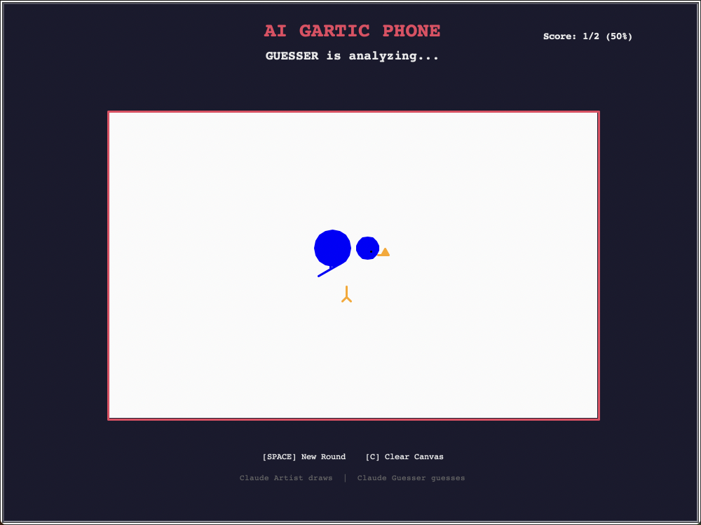

# AI Gartic Phone

Claude draws. Claude guesses. Chaos ensues.

Pick a word, watch the AI render it in turtle graphics, then watch a second AI instance squint at the result and try to figure out what it is. It's Pictionary but both players are the same model having a conversation with itself through drawings.



## Setup

```bash
pip install anthropic pillow python-dotenv mss
```

Add your Anthropic API key to a `.env` file:

```
ANTHROPIC_API_KEY=sk-ant-...
```

Then run:

```bash
python3 game.py
```

## How it works

Each round:
1. A word is picked at random from a built-in list
2. Claude generates Python turtle code to draw it
3. The code runs live in the window
4. A screenshot is taken and sent back to Claude
5. Claude guesses what it drew
6. Correct/wrong is shown, score updates

Press **Space** to start a round, **C** to clear the canvas.

## Notes

- Requires a display (won't run headless)
- Tested on macOS with Python 3.13
